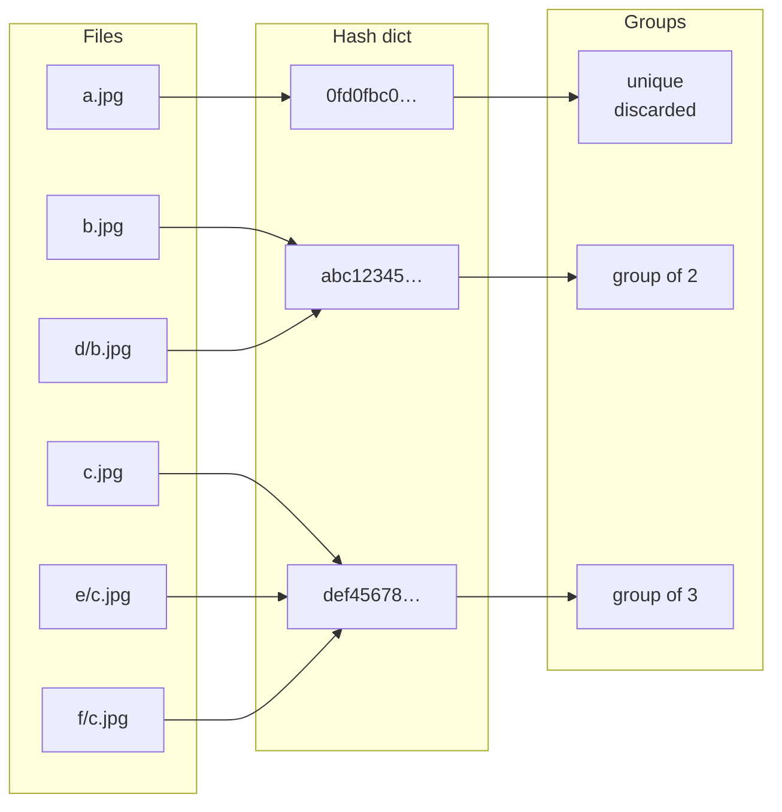
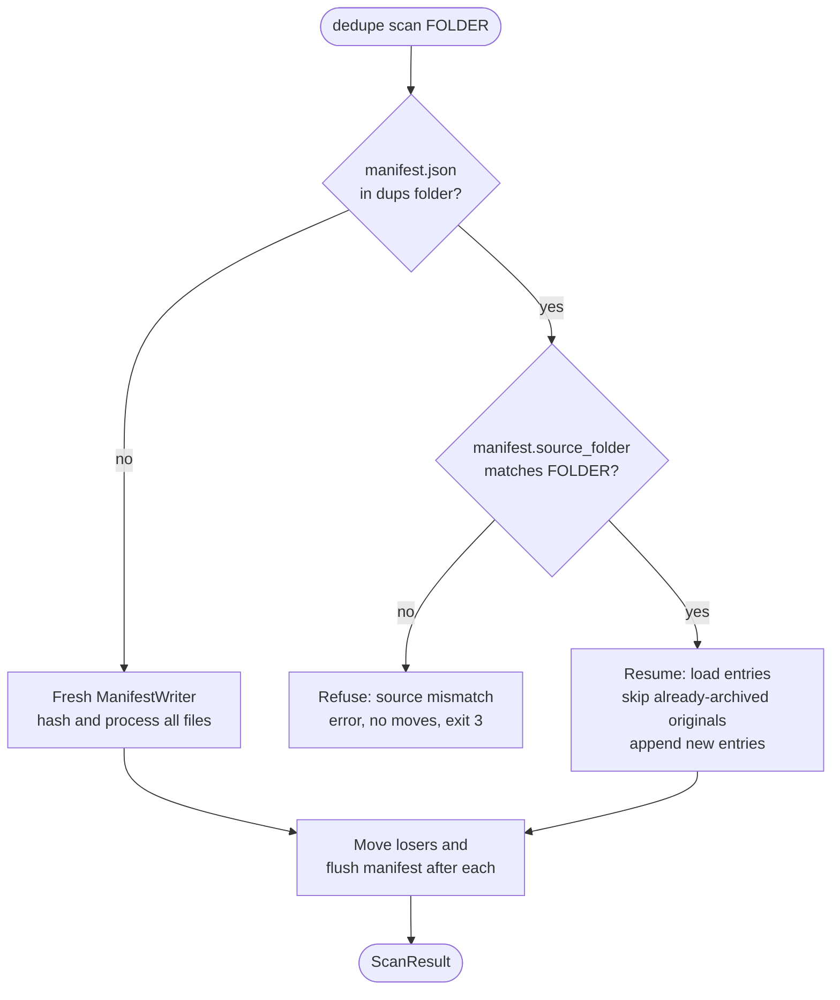
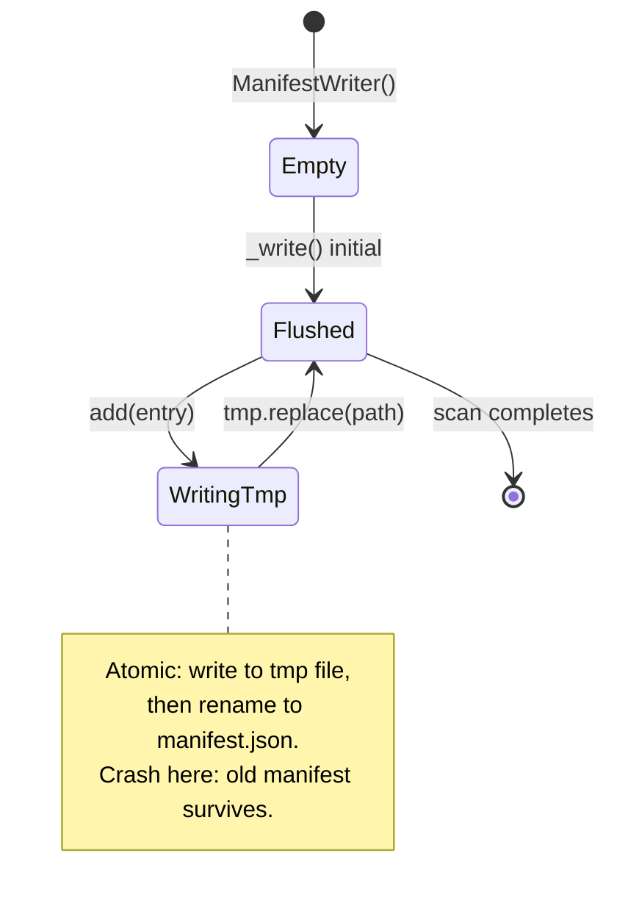

# dedupe — architecture

This document describes how `dedupe` is laid out, how data flows through it,
and which design choices are load-bearing. Read it before making non-trivial
changes.

## Goals

- **Safety over speed.** Never delete; only move. Refuse to overwrite. Write
  the manifest before / after every move so a crash mid-run leaves an audit
  trail.
- **Determinism.** "Shortest path wins, alphabetical tiebreak" — re-running
  on the same input produces the same outcome.
- **Auditability.** The dups-folder layout mirrors the source, and the
  manifest records every move with hash, paths, size, and timestamp.
- **Lean dependencies.** `argparse` (stdlib) + `rich` for output. Pillow,
  pillow-heif, and imagehash are imported only inside `similar.py`.

## Module map

```
src/dedupe/
├── __init__.py         __version__
├── __main__.py         python -m dedupe
├── ui.py               rich-backed console; respects --quiet, --json, --no-color, NO_COLOR
├── walk.py             generic file-tree walker + filter helpers (is_hidden, matches_exclude, rel)
├── manifest.py         AtomicManifestWriter[Entry] generic + scan-specific ManifestWriter wrapper
├── scan.py             SHA-256 hashing, grouping, move-to-quarantine
├── restore.py          manifest replay with conflict detection
├── similar.py          perceptual hash, grouping, HTML report
├── convert.py          image format conversion (originals untouched)
├── info.py             read-only folder stats / breakdown (no mutation)
├── sweep.py            clear out non-photo content (currently: junk-file mode)
└── cli/                CLI package: one module per subcommand
    ├── __init__.py     main() entrypoint + dispatch
    ├── parser.py       build_parser shell, global flags, exit-code constants
    ├── output.py       shared formatters (format_bytes, future helpers)
    ├── scan.py         `dedupe scan` parser config + handler
    ├── find_similar.py `dedupe find-similar` parser config + handler
    ├── restore.py      `dedupe restore` parser config + handler
    ├── convert.py      `dedupe convert` parser config + handler
    ├── info.py         `dedupe info` parser config + handler
    └── sweep.py        `dedupe sweep` parser config + handler
```

Rules of thumb:

- Only `ui.py` writes to stdout/stderr. Every other module takes a `UI`
  instance and routes through it.
- `similar.py` and `convert.py` are the modules that import Pillow /
  imagehash / pillow-heif. The per-subcommand handlers under `cli/`
  defer those imports lazily so `dedupe scan` doesn't load the imaging
  stack.
- `scan.py`, `restore.py`, `similar.py`, `convert.py`, `info.py`, and
  `sweep.py` each expose a single `run_*` entry point. CLI handlers in
  `cli/<subcommand>.py` build the options dataclass and call it.
- `cli/` is a package, not a single file. Each subcommand owns its
  parser config + `_cmd_*` handler in its own module; `cli/__init__.py`
  iterates a `SUBCOMMANDS` tuple and registers each. Adding a new
  subcommand is "create one file + add one import line."
- `walk.py` owns the shared file-tree walker (`walk_files(opts,
  predicate)`) and the public helpers (`is_hidden`, `matches_exclude`,
  `rel`). `scan.iter_image_files` and `sweep._iter_candidate_files`
  are thin wrappers; `info` keeps a specialized walker (it counts
  hidden + broken-symlink separately) but reuses the helpers.
- `manifest.py` exposes a generic `AtomicManifestWriter[Entry]` plus a
  `ManifestWriter` compatibility shim for scan's keyword-arg API and
  resume support. `convert` and `sweep` use the generic directly via
  small factory functions (`_make_archive_manifest_writer`,
  `_make_sweep_manifest_writer`).
- Filesystem mutation is confined to: `_move_one()` in `scan.py`, the
  `shutil.move(...)` calls in `restore.py` and `convert.py` (the latter
  during `--archive-originals`), the `Image.save(...)` call in
  `convert.py` (writing to a *new* output file only), and the
  `path.unlink()` call in `sweep.py` (only when `--junk` is set, only on
  the hardcoded `JUNK_FILES` allowlist).
- **The `unlink()` in `sweep.py` is the only deletion path in the tool.**
  It exists as a deliberate, narrow exception to the "never delete"
  invariant — see `CLAUDE.md` "Safety Invariants" and the "Data flow —
  `dedupe sweep`" section below for the reasoning. `os.remove`,
  `shutil.rmtree`, and `Path.rmdir` are not used anywhere.

## Data flow — `dedupe scan <folder>`

```
folder
  │
  ▼
iter_image_files()         walk + filter (extension, hidden, symlinks)
  │  list[Path]
  ▼
HashCache.open()           load `.hash-cache.jsonl` from dups folder
  │                        (skipped on dry-run)
  ▼
_hash_all(cache=...)       ThreadPoolExecutor;
  │                          hit:   reuse cached digest, skip SHA-256
  │                          miss:  stream-hash, append to cache
  │  dict[hash, list[Path]], cache_hits
  ▼
filter groups where len > 1
  │  duplicate groups
  ▼
for each group:
  pick_keeper()            shortest-path, alphabetical tiebreak
  for each loser:
    _mirror_destination()  source/foo/x.jpg → dups/foo/x.jpg
    _move_one()            shutil.move; refuses to overwrite
    ManifestWriter.add()   atomic write of full manifest after every entry
  │
  ▼
ScanResult                 counts, errors, list[ManifestEntry]
```

### Hash cache (`.hash-cache.jsonl`)

The expensive part of `scan` is SHA-256 over the image bytes — for a
100GB+ library, multiple minutes. Without a cache, an interrupted
scan threw away every byte of hash work on restart. The persistent
cache fixes that:

- **Where:** `<dups-folder>/.hash-cache.jsonl`, alongside the
  manifest. Survives across runs; deleted only by the user.
- **Format:** newline-delimited JSON. First line is a `_header`
  (version, source_folder, created_at). Each subsequent line is one
  entry: `{"path", "mtime_ns", "size", "sha256"}`. Append-only —
  later lines override earlier lines for the same path.
- **Invalidation:** `(mtime_ns, size)` must match exactly. Any drift
  → cache miss → fresh hash → cache update. The cache never returns
  a digest for a file that has changed on disk.
- **Lazy creation:** `HashCache.open()` does not touch the disk. The
  file (and parent folder) are created on the very first `set()`,
  so a no-op scan never side-effects the filesystem.
- **Concurrency:** `set()` is thread-safe. The internal lock
  serializes writes; the dominant cost is still SHA-256.
- **Failure modes:** missing file → empty cache (no-op). Corrupt
  header → discard and rebuild (logged). Source-folder mismatch →
  discard (the cache was for a different scan). Single corrupt entry
  line → skip that line, keep the rest.

Side-effect: a no-duplicates scan now creates the dups folder
(holding only the cache file). This is intentional — the next run
benefits from the seeded cache. No `manifest.json` is written when
no duplicates were found.

### Failure modes and what they map to:

| What goes wrong | Reported as |
|---|---|
| File can't be opened for hashing | `errors[]` entry, file skipped, exit code 3 |
| `stat()` fails on a duplicate | `errors[]`, file skipped, exit code 3 |
| Destination already exists in dups folder | `FileExistsError` → `errors[]`, exit code 3 |
| Source folder doesn't exist | `FileNotFoundError` from `run_scan` → exit code 1 |
| Bad CLI usage | argparse default → exit code 2 |
| Clean run, no errors | exit code 0 |

## Data flow — `dedupe restore <folder>`

```
folder
  │
  ▼
detect manifest filename:
  manifest.json       → scan path
  sweep-manifest.json → sweep path
  both present        → ValueError (refuse to silently pick)
  neither             → FileNotFoundError
  │
  ▼
┌─ scan path ──────────────────┐    ┌─ sweep path ────────────────────────┐
│ manifest_mod.load(.json)     │    │ _load_sweep_manifest(.json)         │
│   validates schema/version   │    │   raw dict; version=1 enforced      │
│ for each entry:              │    │ for each entry:                     │
│   move new_path → original   │    │   action="moved":  reverse the move │
│   refuse-to-overwrite        │    │   action="deleted": count, no-op    │
│                              │    │   refuse-to-overwrite               │
└──────────────────────────────┘    └─────────────────────────────────────┘
  │
  ▼
RestoreResult              manifest_kind, files_restored, files_skipped,
                           deleted_entries, conflicts, errors
```

Conflict policy: **always skip, never overwrite.** Same contract on
both paths — the reverse-direction analog of the "refuse to overwrite"
rule in `scan` and `sweep`.

Deleted-entry policy (sweep only): junk-mode entries with `action="deleted"`
are counted into `RestoreResult.deleted_entries` but never recreated.
The deletes target auto-regenerated OS metadata (`.DS_Store`, `Thumbs.db`,
`desktop.ini`, `.AppleDouble`); the OS reproduces them on the next
folder browse. Reporting beats fabricating.

The two loaders are deliberately separate (`manifest.load` for scan,
a private `_load_sweep_manifest` for sweep) so a schema bump on one
side never silently breaks the other.

## Data flow — `dedupe find-similar <folder>`

```
folder
  │
  ▼
iter_image_files()         (same eligibility rules as scan)
  │
  ▼
_compute_phash() per file  Pillow open → imagehash.phash, hash_size=8 (64-bit)
  │  list[(Path, ImageHash)]
  ▼
_group_by_threshold()      union-find; (i, j) merged iff hamming_distance <= threshold
  │  list[list[Path]]      singletons dropped
  ▼
console summary            "Group N · M images, anchor pHash …"
  │
  ▼
_write_html_report()       self-contained HTML; thumbnails as base64 data URIs
```

`find-similar` is **structurally read-only**: there are no `shutil.move` or
file-mutation calls anywhere in `similar.py`. A test
(`test_find_similar_does_not_move_files`) asserts the source folder is
unchanged after the run.

## Data flow — `dedupe info <folder>`

```
folder
  │
  ▼
walk source                opts.source.rglob('*') if recursive else iterdir()
  │
  ▼
filter                     symlink rule, hidden rule, _matches_exclude(),
                           classify image vs non-image by IMAGE_EXTENSIONS
  │  list[Path] + per-file ext / size
  ▼
tally                      Counters keyed by extension; running totals for
                           total_files / image_files / non_image_files /
                           hidden_files / broken_symlinks / total_size_bytes /
                           image_size_bytes
  │
  ▼
InfoResult                 prints a Summary + per-extension table to the UI;
                           emits a structured payload when --json is set
```

`info` is **structurally read-only**: never opens a write handle, never
moves or deletes anything. Reuses `_is_hidden` and `_matches_exclude`
from `scan.py` so the eligibility filter behaves identically across
commands. Counts non-image files too (which `iter_image_files` would
skip), so it doubles as a "what's actually in this folder?" tool.

## Data flow — `dedupe sweep <folder>`

`sweep` is the multi-category cleanup subcommand. Three modes
(combinable in one invocation):

| Mode | Default action | Default destination |
|---|---|---|
| `--junk` | delete + log | `<folder>-sweep-log/sweep-manifest.json` (audit only) |
| `--junk --quarantine-junk` | move to mirrored quarantine | `<folder>-junk/` |
| `--non-images` | move (always) | `<folder>-non-images/` |
| `--videos` | move (always) | `<folder> - videos/` (mirrored subdirs gain ` - videos` suffix) |

```
folder
  │
  ▼
walk_files (include_hidden=True)   junk files like .DS_Store are hidden by name;
                                   default hidden-skip filter would miss them
  │
  ▼
classify each file:
  basename in JUNK_FILES         → category=junk
  ext in VIDEO_EXTENSIONS        → category=videos
  ext in IMAGE_EXTENSIONS        → SKIP (sweep never touches images)
  else                           → category=non-images
  │
  ▼
filter to enabled categories     only categories whose flag is set get processed
  │  bucket: dict[category, list[Path]]
  ▼
build per-category plan:
  for each non-empty bucket:
    pick destination (junk-delete uses log_folder; others use quarantine_folder)
    pick action (delete only for junk-delete; move otherwise)
    open AtomicManifestWriter[SweepEntry] in destination
  │
  ▼
for each plan, for each file:
  if action=delete:  path.unlink() (only path in tool that calls unlink())
  if action=move:    mirror layout into destination, refuse overwrite,
                     shutil.move()
  manifest.add(entry)              atomic per-entry flush
  result.{junk|non_images|videos}_swept += 1
  │
  ▼
SweepResult           files_scanned, files_swept (aggregate), per-category counters,
                      bytes_swept, errors, entries
```

### Safety: the deliberate-exception rule

`sweep --junk` is the **first and only** place in the tool where deletion
is the default action. The exception is narrowly scoped:

- **Hardcoded allowlist.** `JUNK_FILES = {Thumbs.db, .DS_Store, desktop.ini, .AppleDouble}`. Adding entries requires a PR with justification.
- **Opt-in.** `dedupe sweep <folder>` with no flags is a no-op — the user must explicitly pass `--junk`.
- **Logged.** Every deletion is recorded in `<folder>-sweep-log/sweep-manifest.json` with the original path, size, and timestamp.
- **Override available.** `--quarantine-junk` flips back to move-to-mirrored-quarantine.

`--non-images` and `--videos` always move (never delete) — they handle
arbitrary user content, where the regular "never delete" invariant
applies. The audit's `check_no_destructive_calls.sh` enforces this in
CI: the only `Path.unlink()` call in `src/dedupe/` is in `sweep.py`'s
junk-deletion path; if anyone introduces a destructive call elsewhere
(or in another sweep mode), the audit fails.

### Why one walk for multiple modes

The classifier (`_classify(path)`) returns the category each file
belongs to (or `None` for images). One walk over the source tree
produces a single classification per file; the dispatch into per-category
buckets lets us run all three modes in a single invocation without
re-walking. Each enabled category gets its own destination and its own
manifest, so a restore of one category is independent of the others.

### Why we don't call `iter_image_files`

`scan.iter_image_files` filters out hidden files and non-image
extensions — exactly the files `sweep` needs to find. Sweep instead
calls `walk.walk_files` directly with `include_hidden=True` and no
predicate, then narrows via `_classify()` per file.

### Video destination layout (`<folder> - videos/`)

`--videos` writes to a single sibling wrapper named `<source> - videos/`.
Inside that wrapper, every mirrored subdirectory gains a ` - videos`
suffix while the basename of each video file is left untouched. The
result is a path that is self-documenting at every level:

```
Photos/                               Photos - videos/
  2008 - iPhone/      ──┐               2008 - iPhone - videos/
    movie.mov           │                 movie.mov
  2009 - iPhone/        ▼                 …
    archive/                            2009 - iPhone - videos/
      old.mov                             archive - videos/
  trip.mov                                  old.mov
                                          trip.mov  ← root files keep their name
```

Why the redundant suffix at every level: when the wrapper or any of
its subfolders is later moved, copied, or shared in isolation, the
" - videos" tag travels with it. A folder named `2008 - iPhone - videos/`
is unambiguously the video pull from `2008 - iPhone/` no matter where
it ends up — there is no metadata file or path-context to lose. Source-
root files (no parent directory under source) are placed directly under
the wrapper because there is no parent name to suffix.

The translation is implemented by `_videos_dest_for(rel_path)` in
`sweep.py`. It is idempotent: re-applying it to a path whose parents
already end in ` - videos` is a no-op, so a manifest replay or restore
that re-walks the destination tree never accumulates double suffixes.

This layout differs from `--junk` and `--non-images`, which mirror the
source tree directly into their wrapper folder without per-segment
renaming. Junk/non-images quarantines are typically transient (the
user reviews and either restores or deletes), so the path remains
attached to its wrapper. Videos are typically kept long-term, so the
self-documenting path matters.

### Video format coverage (`VIDEO_EXTENSIONS`)

`sweep --videos` was added because slideshow software in the field
silently chokes on `.mov`/`.mp4` files mixed in with photos. The
constant is a deliberate allowlist (see the comment block above
`VIDEO_EXTENSIONS` in `src/dedupe/sweep.py`) covering 20 extensions
across the formats consumer slideshow workflows actually encounter:
modern phones (`.mov`, `.mp4`, `.m4v`), older Windows captures
(`.avi`, `.mkv`, `.wmv`, `.asf`), Flash legacy (`.flv`, `.f4v`),
open-web (`.webm`), MPEG program streams (`.mpg`, `.mpeg`), 3GPP
mobile (`.3gp`, `.3g2`), AVCHD camcorders (`.mts`, `.m2ts`), DVD
rips (`.vob`), Linux screencasts (`.ogv`), DivX-AVI variants
(`.divx`), and GoPro preview files (`.lrv`).

Three classes of format are deliberately **excluded**:

- `.ts` (MPEG transport stream) — same extension as TypeScript source.
  The asymmetric cost of moving a developer's TS source file outweighs
  the rare gain of catching a transport-stream video in a photo folder.
- `.rm`, `.rmvb` (RealMedia) — effectively extinct.
- `.mxf`, `.hevc`, `.h264` — broadcast/professional or raw codec
  streams. Niche; not seen in consumer slideshow workflows.

The action is "move to `<folder> - MOV/`", not "delete", so the safety
cost of an overzealous match is low. Adding new extensions to
`VIDEO_EXTENSIONS` should be a PR with a brief justification.

## Data flow — `dedupe convert <folder>`

```
folder
  │
  ▼
iter_image_files()         (same eligibility rules as scan)
  │
  ▼
filter by source_exts      default: {.heic, .heif}; overridable via --source-ext
  │  list[Path]
  ▼
plan output paths          mirror layout into <folder>-converted/, swap extension
  │  list[(src, dest)]
  ▼
ThreadPoolExecutor         _convert_one() per pair, dispatching on --on-conflict:
  │                          dest doesn't exist  → write JPG (OUTCOME_CONVERTED)
  │                          skip            (default) → raise FileExistsError
  │                          archive-anyway          → no write, original archived
  │                          number                  → write IMG-1.jpg, IMG-2.jpg, ...
  │                          overwrite               → replace existing JPG
  ▼
[optional] archive pass    if --archive-originals (or --in-place, which implies it):
                             for each entry in result.conversions sequentially move
                             the original into <folder>-heic/ (mirroring
                             layout) and append an entry to
                             archive-manifest.json. archive-anyway entries flow
                             through this pass identically — the JPG-keep is
                             decoupled from the HEIC-archive.
  │
  ▼
ConvertResult              files_scanned, files_converted, files_skipped,
                           files_kept_existing, files_numbered, files_overwritten,
                           bytes_written, files_archived, errors,
                           conversions, archive_entries
```

### `--on-conflict` modes (#47)

`dedupe convert --in-place` runs face-first into the iPhone HEIC+JPG
pair pattern: every shot exists as both `IMG_001.heic` and
`IMG_001.jpg`, so writing the converted JPG hits a destination
conflict. Four modes resolve it:

| Mode | New JPG written? | HEIC archived? | Use case |
|---|---|---|---|
| `skip` (default) | No (raises) | No | Conservative; preserves v0.12.x semantics. |
| `archive-anyway` | No | **Yes** | iPhone HEIC+JPG pairs. The existing JPG is canonical; the HEIC is redundant. |
| `number` | Yes (`IMG_001-1.jpg`) | Yes | Different photos that happen to share a basename. Both files coexist. |
| `overwrite` | Yes (replaces) | Yes | Power-user. The previous JPG is lost. |

Only the conflicting destinations branch into one of the four modes.
Files whose JPG twin doesn't exist take the happy path
(`OUTCOME_CONVERTED`) regardless of mode.

`number` uses `_find_numbered_destination(dest)`, which walks
`dest-1`, `dest-2`, `...` and returns the lowest-N path that doesn't
exist. Race-prone under threads (two workers could pick the same
suffix), but the source files have unique names so the only way it
bites is when the source itself contains files that already use the
suffix scheme.

Without `--archive-originals` (the default), `convert` never modifies
the source folder — the only filesystem mutation is `Image.save(dest,
...)` writing to a fresh output path.

With `--archive-originals`, originals are **moved** (not deleted) into
the archive folder via `shutil.move`, and the move is recorded in an
`archive-manifest.json` flushed-after-every-entry. The archive pass is
single-threaded and runs *after* the parallel conversion phase, so the
manifest order matches the conversion order and we don't need a lock
around manifest writes outside the generic
`AtomicManifestWriter[ArchiveEntry]`'s own lock.

These guarantees are covered by:
- `test_convert_jpg_to_png_mirrors_layout` — originals untouched without the flag
- `test_archive_off_by_default_originals_remain` — explicit no-side-effect default
- `test_archive_originals_moves_sources_and_writes_manifest` — full archive flow
- `test_archive_default_folder_is_folder_dash_heic` — default name
- `test_archive_dry_run_moves_nothing` — dry-run respected
- `test_archive_refuses_to_overwrite` — pre-existing archive path is preserved
- `test_refuses_to_overwrite` — pre-existing output path is preserved

## Class diagram

The codebase is mostly functions plus small frozen dataclasses (option
records, result records, manifest entries). The classes with non-trivial
behavior are `UI` (plus its progress-handle helpers) and
`AtomicManifestWriter[Entry]` — the generic atomic-flushed JSON writer
that backs every manifest in the project. `ManifestWriter` is a thin
compatibility wrapper around the generic that preserves scan's
keyword-arg `add(...)` API and resume-support contract.

```
┌──────────────────────────┐         ┌──────────────────────────────┐
│ UIConfig (dataclass)     │         │ AtomicManifestWriter[Entry]  │
│ - verbose: bool          │         │ + add(entry)        (locked) │
│ - quiet: bool            │         │ + add_existing_entries(...)  │
│ - no_color: bool         │         │ - _flush() (atomic rename)   │
│ - json_mode: bool        │         └──────────────┬───────────────┘
└────────────┬─────────────┘                        │ wraps
             │                                      │
             ▼                       ┌──────────────┴───────────────┐
┌──────────────────────────┐         │ ManifestWriter (scan compat) │
│ UI                       │         │ + add(*, original_path,      │
│ + info / detail /        │         │       new_path, sha256, ...) │
│   success / warn / error │         │ ⤺ resume_from?               │
│ + emit_json              │         └──────────────────────────────┘
│ + progress (cm)          │
└──────────────────────────┘                        ▲
             ▲                                      │ writes
             │ used by                              │
┌────────────┼──────────────────────┐               │
│            │                      │               │
│  ┌─────────┴──────────┐           │               │
│  │ run_scan(opts, ui) │───────────────────────────┤
│  └────────────────────┘           │               │
│  ┌────────────────────┐           │   ┌───────────┴────────────────┐
│  │ run_restore(...)   │──┐        │   │ AtomicManifestWriter       │
│  └────────────────────┘  │        │   │   [ArchiveEntry] (convert) │
│  ┌────────────────────┐  │ reads  │   └────────────────────────────┘
│  │ run_find_similar(…)│  │        │   ┌────────────────────────────┐
│  └────────────────────┘  │        │   │ AtomicManifestWriter       │
│  ┌────────────────────┐  │        │   │   [SweepEntry]   (sweep)   │
│  │ run_convert(...)   │──────────────▶└────────────────────────────┘
│  └────────────────────┘  │        │   ┌────────────────────────────┐
│  ┌────────────────────┐  │        │   │ manifest.load(path)        │
│  │ run_info(...)      │  │        │   │   → returns Manifest +     │
│  └────────────────────┘  │        │   │     list[ManifestEntry]    │
│  ┌────────────────────┐  │        │   └────────────────────────────┘
│  │ run_sweep(...)     │──────────────▶                              │
│  └────────────────────┘  │        │
│                          └────────────                              │
│   run_* called from cli/<subcommand>.py handlers                    │
└─────────────────────────────────────────────────────────────────────┘

  Module split (one parser+handler per subcommand):

    cli/__init__.py        main() + dispatch
    cli/parser.py          build_parser, add_global_flags, exit codes
    cli/output.py          format_bytes (and future shared formatters)
    cli/scan.py            register() + _cmd_scan()
    cli/find_similar.py    register() + _cmd_find_similar()
    cli/restore.py         register() + _cmd_restore()
    cli/convert.py         register() + _cmd_convert() + _resolve_source_exts()
    cli/info.py            register() + _cmd_info()
    cli/sweep.py           register() + _cmd_sweep() + _emit_summary()

  Walker (consolidated in walk.py):

    walk_files(WalkOptions, predicate=...)  ← used by scan, sweep, convert
    is_hidden(path, source)                 ← public helper
    matches_exclude(path, source, patterns) ← public helper
    rel(path, source)                       ← public helper

  Options & results (all @dataclass(frozen=True) unless noted):

    ScanOptions          ScanResult              SimilarOptions
    RestoreOptions       RestoreResult           SimilarResult
    SimilarGroup         WalkOptions
    ConvertOptions       ConvertResult           ArchiveEntry
    InfoOptions          InfoResult (mutable; counters built up in place)
    SweepOptions         SweepResult             SweepEntry
    ManifestEntry        Manifest (mutable; the on-disk shape)
```

The arrow conventions: solid arrows are "uses / calls". `⤺
resume_from?` on `ManifestWriter` denotes the optional resumable-scan
parameter (preserves `created_at` and existing entries when reopening
a partial run). The `AtomicManifestWriter[Entry]` generic shows up
three times because each subcommand parameterizes it with its own
entry type — but it's the same class under the hood.

## Why argparse instead of Click / Typer?

The spec mandates argparse — keeps the dependency footprint minimal and
gives us argparse's exit-code-2 behavior on bad input for free. The
trade-off is verbosity in subparser setup, which is contained in
`build_parser()` and `add_global_flags()` in `cli/parser.py`. Each
subcommand's own subparser config + handler lives in its own module
under `cli/`, so adding a new subcommand never touches the dispatch
logic.

## Threading model

- `scan` uses `ThreadPoolExecutor(max_workers=opts.threads or None)`.
  Hashing is I/O-bound (read big files from disk); GIL is released during
  the read syscall, so threads are the right shape here.
- `find-similar` is currently single-threaded. Pillow + imagehash do real
  work in Python and don't release the GIL, so threading would not help.
  If we ever care, switch to `ProcessPoolExecutor` — but that would force
  `pillow-heif` registration in each worker, which is annoying to get
  right. Not worth the complexity until profiling says so.

## Algorithm: how `dedupe scan` scales

The high-level pipeline is the ASCII data-flow at the top of this doc.
This section is the *why* — what design choices the algorithm rests on,
how it scales as you point it at bigger trees, and what properties you
get for free.

### The four phases, with rationale

```
1. Discover  →  2. Hash  →  3. Group  →  4. Move
   (1 thread)    (N threads)  (cheap)     (1 thread)
```

**1. Discover (single-threaded, fast).** `Path.rglob('*')` walks the tree
under the source folder. Each entry is run through the eligibility
filter (extension, hidden, symlink, exclude pattern). What's left is a
sorted candidate list. This is metadata-only, so even 50,000 files in a
deep tree finish in a few seconds.

**2. Hash (parallelized, the bottleneck).** Each candidate is
stream-hashed in 1 MiB chunks (`HASH_CHUNK_SIZE = 1 << 20`) into
SHA-256. The whole file is *never* loaded into memory, so a 50 MB RAW
behaves the same as a 200 KB thumbnail. Threads work here because the
GIL is released during `read()` syscalls — while one thread is waiting
on disk, another runs.

**3. Group (cheap).** Filter the `digest → list[Path]` dict to
entries with `len(paths) > 1`. Sort by digest for deterministic
output. O(n) over the dict.

**4. Move (single-threaded, sequential).** For each duplicate group:
pick the keeper (`min(paths, key=lambda p: (len(str(p)), str(p)))`),
mirror each loser's path under the dups folder, refuse to overwrite,
`shutil.move()`, append to the manifest, atomic flush. Single-threaded
because manifest writes need ordering and `rename(2)` is already
millisecond-fast on the same filesystem.

### Why SHA-256, not pairwise byte comparison

For 10,000 photos, **pairwise comparison would be ~50,000,000 pairs**.
Each pair could require reading both files from disk to find the first
differing byte. Worst case: O(n² · filesize) reads.

Hashing flips it: each file is read **exactly once**, end to end. After
hashing, identifying duplicates is a hash-table lookup — effectively
free. Total cost: O(n · filesize) reads + O(n) memory.



### Why a *cryptographic* hash specifically

SHA-256's collision probability is ~1 in 2¹²⁸ for any two random
inputs. You'd need more files than there are atoms in the observable
universe before a false-positive collision became likely.

Faster non-cryptographic hashes (xxhash, MD5) would speed up the
hashing phase slightly, but:

- **MD5 has known engineered collisions.** A malicious actor could
  craft files that "look like" duplicates. Not a real concern for
  personal photos, but the reason crypto hashes are the safer default.
- **Hashing isn't the bottleneck — disk I/O is.** SHA-256 on a 5 MB
  JPEG is ~10 ms; reading the same file from a fast SSD is ~50 ms.
  Faster hash, same wall clock.

### Memory profile

| Item | Per-file cost | At 50,000 photos |
|---|---|---|
| Path string in candidate list | ~80 bytes | ~4 MB |
| Hash dict entry (path + 64-char hex digest + overhead) | ~150 bytes | ~7 MB |
| Manifest entries (5 path-ish strings + size + timestamp) | ~300 bytes | ~15 MB *if all were duplicates* |

Memory scales linearly and stays trivial. Even a 100K-photo run barely
registers. The bottleneck is disk I/O, not RAM.

### Time profile

For a typical photo set on a fast NVMe SSD:

| Phase | Throughput | At 50,000 photos |
|---|---|---|
| Discover (`rglob` + filter) | ~100K paths/sec | ~0.5 s |
| Hash (8 threads, ~5 MB avg JPEG) | ~500–1000 files/sec | 50–100 s |
| Group | hash-table operations | <0.01 s |
| Move (rename + manifest flush) | ~500 ops/sec | depends on dup count |

Hashing dominates. On a network mount (NAS), per-file latency goes up
10–100×, and **threaded reads help much more there** than on a local
SSD because most threads are blocked on round trips at any moment.

### Two properties you get for free

**Deterministic.** Same input → same output. Re-running on the same
folder twice produces the same duplicate groups (hashing is
deterministic), the same keeper for each group (shortest-path rule is
deterministic), and the same manifest entries in the same order
(groups are iterated in sorted-digest order).

**Resumable.** If `<dups>/manifest.json` already exists for the same
source folder, `run_scan` loads it, builds a `set[str]` of
`original_path`s already archived, and skips them in the move phase. A
Ctrl-C'd 50K-file scan picks up exactly where it left off.



### Manifest atomicity

The manifest is the source of truth for `restore`. Every entry is
flushed before the next move starts, so a crash mid-run leaves a
manifest that points at the moves that *did* happen — never a
half-written entry.



`_write()` writes to `<path>.tmp` and then `tmp.replace(path)`. POSIX
`rename(2)` is atomic on the same filesystem, so concurrent readers
never see a partially-written manifest.

### Where the algorithm could break down

Failure modes only relevant at scales we don't currently target:

- **`rglob` itself slows on enormous trees** (10M+ files) because it
  stats every entry. Fix: parallel walk; not Python-easy. Not your
  case.
- **Path strings dominate memory** at 10M+ files. The hash dict + path
  list could push past 1 GB. Not your case.
- **Hash dict lookups slow** when the dict outgrows L3 cache (~30 MB
  at typical sizes). For 100K entries we're well inside.

For a slideshow-prep workload (a few thousand to a few tens of
thousands of files), runtime is **completely dominated by how fast
your disk can read all the photos once**. Everything else is noise.

### Tunables and their relative impact

- **`--threads N`** — defaults to CPU count. On NVMe, more threads
  beyond ~8 help less; on a NAS, going to 16–32 can be a big win.
- **`--exclude PATTERN`** — biggest performance lever. Skipping a
  30K-file `screenshots/` folder cuts the run proportionally.
- **`--no-recursive`** — limits to the top-level. Useful if you only
  want to dedup the immediate folder.

## Manifest format and forward compatibility

`manifest.json` carries an explicit `"version": 1` field. `manifest.load`
refuses any other version with a clear error. If the schema ever needs to
change, bump the version, write a migration in `manifest.py`, and update
the `MANIFEST_VERSION` constant.

The on-disk format is pretty-printed JSON — bigger on disk, but trivially
inspectable from a shell when something goes wrong, which matters more
than file size for a manifest that grows linearly with duplicates moved.

## CI and release pipeline

`.github/workflows/ci.yml` defines two jobs:

- **`test`** — runs on every push to `main`, every PR to `main`, and
  every `v*` tag push. Matrix across Python 3.11/3.12/3.13. Steps:
  install package + dev deps, `ruff check`, `pyright`, `pytest -q`.
  Branch protection on `main` requires all three matrix jobs to pass
  before a PR can merge.

- **`release`** — gated with
  `if: startsWith(github.ref, 'refs/tags/v')`, so it only fires on
  tag pushes. `needs: test`, so a tag won't ship a wheel unless the
  matrix is green. Steps: checkout, set up Python 3.13,
  `python -m build`, then upload `dist/*.whl` and `dist/*.tar.gz` to
  the GitHub release matching the tag.

The upload step is self-healing: if a release already exists for the
tag (the standard flow — `gh release create ... --notes "..."` first
to get rich notes), it uploads with `--clobber`. Otherwise it creates
the release with `--generate-notes` so the workflow always succeeds.

**Why this shape:**
- Pure Python wheel (`py3-none-any`) — built once, works on any
  platform with Python ≥ 3.11. No native compilation, no platform
  matrix.
- Tag-driven, not branch-driven, so merging to `main` doesn't
  accidentally publish.
- Test-gated, so a broken tag never ships an installable artifact.
- Idempotent on the upload side, so re-running the workflow on the
  same tag (e.g. after a CI infra hiccup) is safe.

To install a tagged release without cloning:

```bash
pip install git+https://github.com/mickmill54/image-deduper.git@vX.Y.Z
```

…or download the wheel from the release page and `pip install` it
directly.

## Testing strategy

- `tests/conftest.py` builds fixture trees programmatically with Pillow.
  No checked-in binary fixtures — the `git diff` for any test change is
  always a Python-source diff.
- `fixture_tree` exercises the scan/restore round trip with two duplicate
  groups (one JPEG-cluster, one PNG-cluster) plus hidden files and nested
  subdirectories.
- `similar_tree` engineers byte-different / pHash-identical images so the
  similarity test is deterministic.
- The CLI tests (`test_cli.py`) call `dedupe.cli.main(argv)` directly so
  they're fast, in-process, and capture exit codes cleanly.

## Adding a new subcommand

1. **Runtime module** — add `src/dedupe/<name>.py` exposing a `run_<name>`
   function and an `<Name>Options` / `<Name>Result` dataclass pair.
   Use `walk.walk_files(opts, predicate)` for the file walk; use
   `manifest.AtomicManifestWriter[<EntryT>]` for any audit log.
2. **CLI module** — add `src/dedupe/cli/<name>.py` exposing `register(sub)`
   (configures the subparser) and `_cmd_<name>(args, ui)` (the
   handler). Register it in `cli/__init__.py`'s `SUBCOMMANDS` tuple.
3. **Tests** — add `tests/test_<name>.py`. Reuse `fixture_tree` /
   `convert_tree` / `similar_tree` if shape fits; otherwise add a new
   fixture in `conftest.py`.
4. **Docs** — document the flags in `README.md` (subcommand listing +
   flags table + usage example), add a CHANGELOG entry, and add a
   data-flow diagram + (if it adds new safety semantics) an update to
   the safety-invariants section in `CLAUDE.md`.
